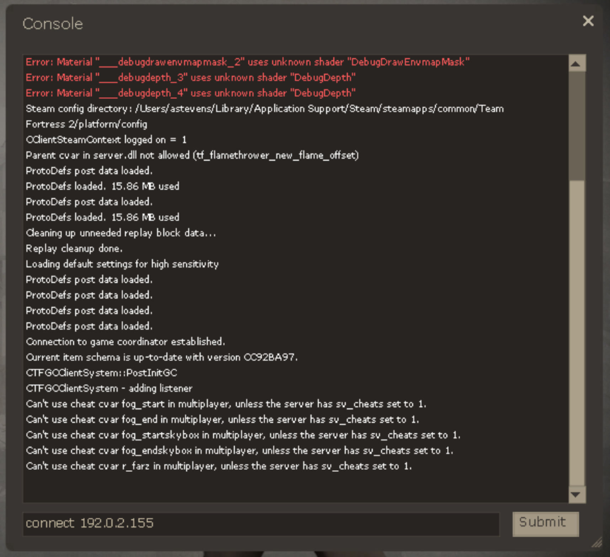

---
author:
  name: Linode Community
  email: docs@linode.com
description: 'Deploy a Team Fortress 2 server on Linode using One-Click Apps.'
keywords: ['team fortress','one-click', 'tf2', 'server']
license: '[CC BY-ND 4.0](https://creativecommons.org/licenses/by-nd/4.0)'
published: 2019-04-04
modified: 2019-03-04
modified_by:
  name: Linode
title: "Deploy a Team Fortress 2 Server with One-Click Apps"
contributor:
  name: Linode
aliases: ['platform/one-click/deploying-team-fortress-2-with-one-click-apps/']
---

## Team Fortress 2 One-Click App

Team Fortress 2 (TF2) is a team-based multiplayer first-person shooter game. In TF2, you and your team choose from 9 unique classes and play against an enemy team in a variety of game modes. These modes include capture the flag, king of the hill, and even a battle pitting your team against a robotic horde.

Setting up a personal game server puts you in control of the game modes and maps you use, as well as a variety of other settings to customize your experience.

### Deploy a Team Fortress 2 One-Click App



The [Team Fortress 2 Options](#team-fortress-2-options) section of this guide provides details on all available configuration options for this app.

### Team Fortress 2 Options

You can configure your Team Fortress 2 App by providing values for the following fields:

| **Field** | **Description** |
|:--------------|:------------|
| **RCON Password** | The password for the remote console, which allows you to issue commands on the TF2 server. *Required*. |
| **Server Name** | Your Team Fortress 2 server's name. *Advanced Options*. |
| **Message of the Day** | Message of the day. Text displayed whenever a player logs on to the server. *Advanced Options* |
| **Server Password** | The password for the TF2 server. Configuring a TF2 server password will require users of your game server to provide this password. *Advanced Options* |
| **Game Server Login Token** | A Steam game server login token. This is required to publicly list your server. To get a Steam Token, visit the [Steam Game Server Account Management](https://steamcommunity.com/dev/managegameservers) page. *Advanced Options* |
| **Team Balance Enabled** | Automatically balance the number of players on a team. *Advanced Options* |
| **Maximum Rounds** | The maximum amount of rounds before the map changes. *Advanced Options* |
| **Round Time Limit** | The time per round, in minutes. *Advanced Options* |

### Linode Options

After providing the app specific options, provide configurations for your Linode server:

| **Configuration** | **Description** |
|:--------------|:------------|
| **Select an Image** | Debian 9 is currently the only image supported by Team Fortress 2 One-Click Apps, and it is pre-selected on the Linode creation page. *Required*. |
| **Region** | The region where you would like your Linode to reside. In general, it's best to choose a location that's closest to you. For more information on choosing a DC, review the [How to Choose a Data Center](/docs/platform/how-to-choose-a-data-center) guide. You can also generate [MTR reports](/docs/networking/diagnostics/diagnosing-network-issues-with-mtr/) for a deeper look at the network routes between you and each of our data centers. *Required*. |
| **Linode Plan** | Your Linode's [hardware resources](/docs/platform/how-to-choose-a-linode-plan/#hardware-resource-definitions). Your TF2 server should be sized based on the amount of traffic you are expecting on your server as well as the game play performance you are looking for. We recommend using a 2GB Linode as the smallest plan to ensure good performance of your game server, though 4GB as a minimum size would ensure better performance of your game server. If you decide that you need more or fewer hardware resources after you deploy your app, you can always [resize your Linode](/docs/platform/disk-images/resizing-a-linode/) to a different plan. *Required*. |
| **Linode Label** | The name for your Linode, which must be unique between all of the Linodes on your account. This name will be how you identify your server in the Cloud Manager’s Dashboard. *Required*. |
| **Root Password** | The primary administrative password for your Linode instance. This password must be provided when you log in to your Linode via SSH. It must be at least 6 characters long and contain characters from two of the following categories: lowercase and uppercase case letters, numbers, and punctuation characters. Your root password can be used to perform any action on your server, so make it long, complex, and unique. *Required*. |

When you've provided all required Linode Options, click on the **Create** button. **Your Team Fortress 2 app should install between 5-15 minutes after your Linode has successfully provisioned**.

## Getting Started after Deployment

Ensure that you have installed Team Fortress 2 to your computer before getting started with this section. You can install Team Fortress 2 from [Steam's Web Store](https://store.steampowered.com/app/440/Team_Fortress_2/).

After the Team Fortress 2 Server One-Click App has finished deploying to your Linode, you will be able to access your server by copying your Linode's IPv4 address and connecting to it within the game installed on your computer. To find your Linode's IPv4 address and connect to it:

1. Click on the **Linodes** link in the sidebar. You will see a list of all your Linodes.

2. Find the Linode you just created when deploying your app and select it.

3. Navigate to the **Networking** tab.

4. Under the **IPv4** heading, you will find your IPv4 address listed under the **Address** column.

5. Copy the IPv4 address.

6. Open Team Fortress 2 on your computer, then open the developer's console by pressing the back tick key (**`**).

7. Type `connect 192.0.2.155`. Replace 192.0.2.155 with the IP address of your Linode, and then click **Submit**.

    

    You will connect to the server.

### Software Included

The Team Fortress 2 One-Click App will install the following required software on your Linode:

| **Software** | **Description** |
|:--------------|:------------|
| [**Team Fortress 2**](http://www.teamfortress.com/) | Game server. |
| [**LinuxGSM**](https://linuxgsm.com) | A command line tool for the deployment and management of Linux game servers. |
| [**UFW**](https://wiki.ubuntu.com/UncomplicatedFirewall) | Firewall utility. Ports 27014:27050/tcp, 3478:4380/udp, 27000:27030/udp, and 26901 will allow outgoing and incoming traffic. |
| [**Fail2ban**](https://www.fail2ban.org/wiki/index.php/Main_Page) | Fail2Ban is an intrusion prevention software framework that protects computer servers from brute-force attacks. |
