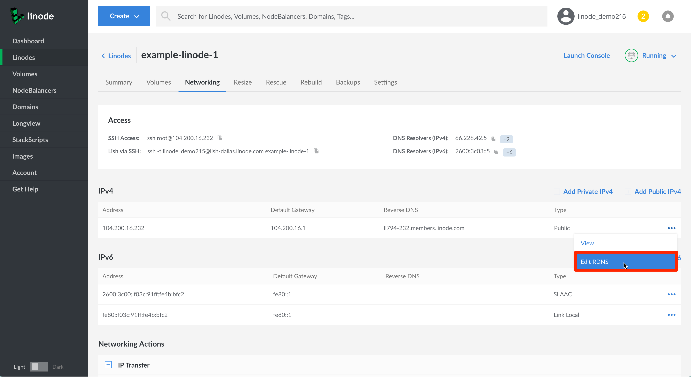
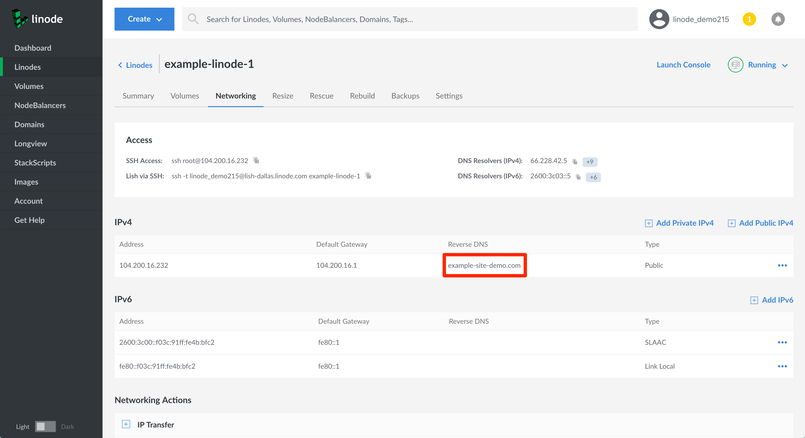

---
author:
  name: Linode
  email: docs@linode.com
description: 'Reverse DNS (rDNS) resolves an IP address to the designated domain name. This guide will teach you how to set it up.'
keywords: ["reverse", "dns", "PTR"]
license: '[CC BY-ND 4.0](https://creativecommons.org/licenses/by-nd/4.0)'
aliases: ['dns-manager/','dns-guides/configuring-dns-with-the-linode-manager/','networking/dns/setting-reverse-dns/','networking/Setting-Up-Reverse-DNS-Lookup/','networking/configure-your-linode-for-reverse-dns/']
modified: 2019-02-27
modified_by:
  name: Linode
published: 2015-07-09
title: Configure Your Linode for Reverse DNS (rDNS)
---


You can also view the Linode Classic Manager version of the [Configure Your Linode for Reverse DNS](/docs/networking/dns/configure-your-linode-for-reverse-dns-classic-manager/) guide.


Computers uses DNS to determine the IP address associated with a domain name. *Reverse* DNS lookup does the opposite by resolving an IP address to a designated domain name. You should always set the reverse DNS, even if your Linode hosts more than one domain.

Reverse DNS uses a *pointer record* (PTR) to match an IP address with a domain or subdomain. PTR records are generally set with a hosting provider, so reverse DNS is set in the Linode Cloud Manager.

Before setting the reverse DNS for your Linode, configure your domain zone and DNS records through Linode's [DNS Manager](/docs/platform/manager/dns-manager-new-manager/). See our [Introduction to DNS Records](/docs/networking/dns/dns-records-an-introduction/) and [Common DNS Configurations](/docs/networking/dns/common-dns-configurations/) guides for more information about PTR and DNS.

## Setting Reverse DNS

1. Click on the Linodes link in the sidebar to access a list of all your Linodes.

1. Select the Linode whose reverse DNS you would like to set up and click on its **Networking** tab.

1. Find the IP address whose reverse DNS you would like to set up and click on its more options **ellipsis (...)**. Then, select **Edit RDNS** from the dropdown menu.

    

1. In the **Edit Reverse DNS** field, add your Linode's fully qualified domain name and click on the **Save** button. You should now see the domain name you entered listed under the **Reverse DNS** column.

    

    
  If you want to set up reverse DNS for both the IPv4 and IPv6 addresses, you can perform the same steps for the IPv6 address.
    
