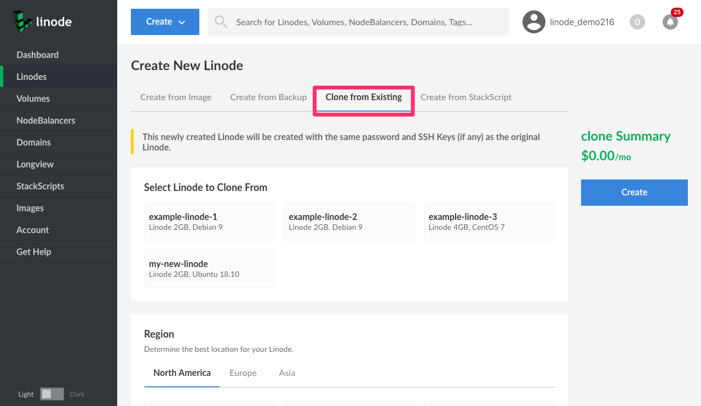

---
author:
  name: Nick Brewer
  email: docs@linode.com
description: Clone your Linode to another Linode.
keywords: ["clone", " cloning", "cloud manager"]
license: '[CC BY-ND 4.0](https://creativecommons.org/licenses/by-nd/4.0)'
aliases: ['migrate-to-linode/disk-images/clone-your-linode/']
modified: 2019-03-07
modified_by:
  name: Linode
published: 2016-11-21
title: 'Clone Your Linode'
---

You can view the [Classic Manager version of this guide](/docs/platform/disk-images/clone-your-linode-classic-manager/).


This guide will show you how to clone an existing Linode.

## Clone Your Linode

1.  Log in to the [Linode Cloud Manager](https://cloud.linode.com).
2.  **Recommended**: Power off the Linode you would like to clone. This is recommended to prevent data corruption.
3.  Click **Create** at the top of the Cloud Manager and select **Linode**.
4.  On the *Create New Linode* page, click on the **Clone from Existing** tab.

     

5.  Under **Select Linode to Clone From**, click on the Linode you wish to clone.
6.  Select the region for the clone.
7.  Select the plan for the clone.

    
You will not be able to choose a plan for your clone that is smaller than the plan of the cloned Linode. For example, a 2GB Linode can not be cloned into a 1GB Nanode.


8.  Provide a label for your new Linode.
9.  Click **Create**.

The cloning process will begin. Depending on the size of your Linode, it may take some time. You will see a status bar above the Linode you cloned with the percentage of completion. While your Linode is being cloned, your new clone will appear on the Linodes page in a powered off state. Once the cloning process is complete you will need to power on your new Linode.
