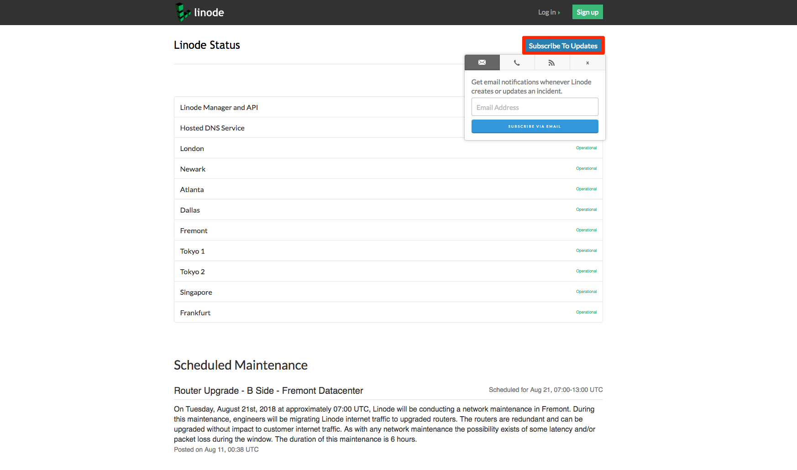

---
author:
  name: Linode Community
  email: docs@linode.com
description: 'Learn how to subscribe to Linode system status and maintenance updates.'
keywords: ['linode','maintenance','incident','system', 'status']
license: '[CC BY-ND 4.0](https://creativecommons.org/licenses/by-nd/4.0)'
published: 2018-08-20
modified: 2018-08-20
modified_by:
  name: Linode
title: "Subscribe to Linode Status Updates"
contributor:
  name: Linode
---
The [Linode Status Page](https://status.linode.com/) provides system status and maintenance updates. You can subscribe to these real-time notifications via email, SMS, and Atom and RSS feed. All Linode customers are encouraged to subscribe to Linode Status notifications to stay up to date with any events that may impact your service.

When you sign up for Linode status updates via email or SMS, you can fine-tune which service updates you receive. These different topic areas are referred to as *components*. If, for example, all your Linodes are restricted to the Newark Data Center, you may only wish to subscribe to the Newark component. You can also subscribe to individual incident notifications.



- Linode Manager and API
- Hosted DNS Service
- London
- Newark
- Atlanta
- Dallas
- Fremont
- Tokyo 1
- Tokyo 2
- Singapore
- Frankfurt


## Subscribe to Updates

To subscribe to Linode system status and maintenance updates:

1. Navigate to the [Linode Status Page](https://status.linode.com/).

1. Click on the **Subscribe to Updates** button and select your preferred notification format. The available options are email, SMS, and RSS feed.

    

    **Email or SMS**

- If selecting email or SMS, provide your contact information and click on the **Subscribe via Email** or **Subscribe via SMS** button.

- You will be brought to the Notifications Subscription page where you can select which components to be updated on.

- Click on the **Update Preferences** button.

    - If you are signing up for email notifications, you will need to check your email and confirm the subscription before you will start to receive updates.

    - If you are signing up for SMS notifications, you will receive a text message with instructions on how to confirm your subscription.

    **RSS**
- If selecting RSS, click on the Atom Feed or RSS Feed link. You will be brought to a page with the raw XML feed.

- Copy the page's URL. Navigate to your RSS aggregator and paste the URL when setting up the feed.

## Subscribe to an Incident

To subscribe to updates for a specific incident:

1. Navigate to the [Linode Status Page](https://status.linode.com/).

1. Find the incident you would like to follow and click on its heading. You will be brought to that incident's page.

1. Click on the **Subscribe to Updates** button and provide your Email and/or telephone number.

## Update Notification Preferences or Unsubscribe

You can update your component preferences or cancel your subscription to Linode status and maintenance updates at any time. To update your preferences or to unsubscribe:

1. Navigate to the [Linode Status Page](https://status.linode.com/).

1. Click on the **Subscribe to Updates** button and select the notification format you would like to update or unsubscribe from.

    **Email or SMS**

- Enter in your contact information and click on the **Subscribe to Updates** button.

- You will be brought to your Notification Subscription page. Update your preferences, as needed, and click on the **Update Preferences** button.

- If you would like to unsubscribe, click on the **Cancel Subscription** link in the Subscriber section of the page and follow the prompt.


You can unsubscribe from SMS alerts by replying to any text message alert with the word "STOP".


**RSS**

- To unsubscribe from Linode status updates via RSS, use your RSS aggregator's settings to remove the feed.