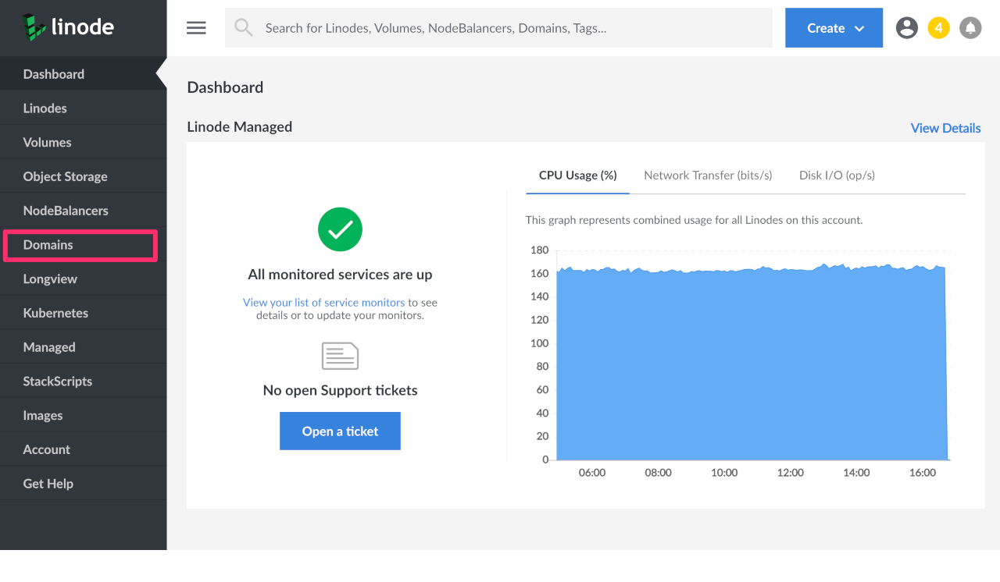
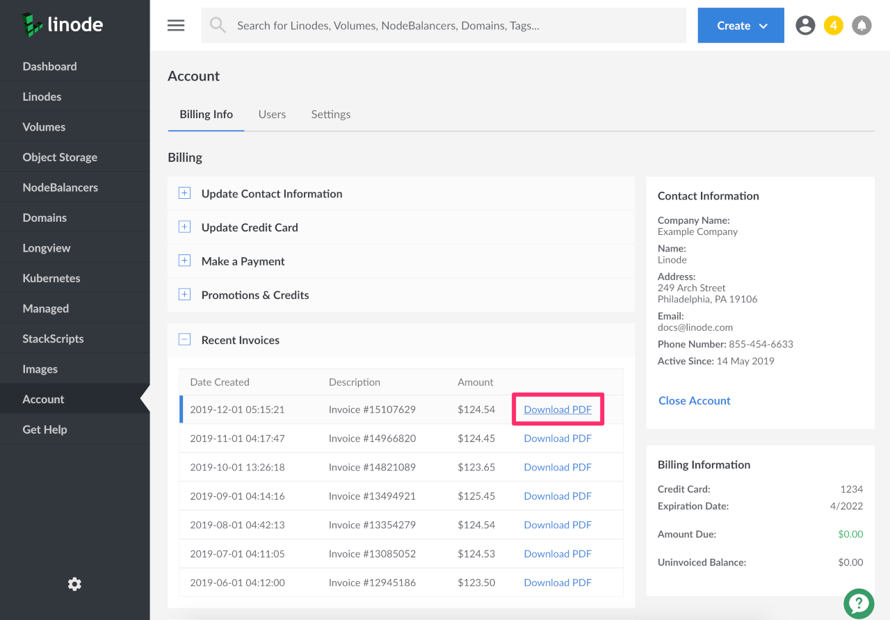
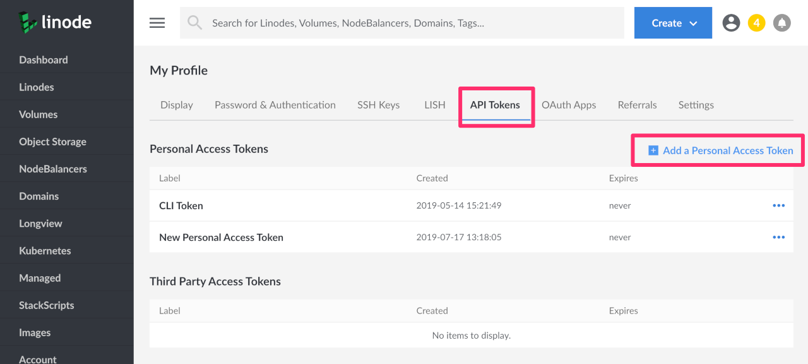

---
author:
  name: Linode
  email: docs@linode.com
description: 'This guide provides an overview of the Linode Cloud Manager. You will find information about each section of the Cloud Manager, specific features that you may need help finding, and settings that might make your overall Cloud Manager experience better.'
og_description: 'This guide provides an overview of the Linode Cloud Manager. You will find information about each section of the Cloud Manager, specific features that you may need help finding, and settings that might make your overall Cloud Manager experience better.'
keywords: ["classic manager","cloud manager","linode"]
license: '[CC BY-ND 4.0](https://creativecommons.org/licenses/by-nd/4.0)'
aliases: ['platform/manager/a-classic-to-cloud-manager-overview-guide/']
published: 2019-12-20
modified: 2020-01-29
modified_by:
  name: Linode
title: 'An Overview of the Linode Cloud Manager'
h1_title: 'An Overview of the Linode Cloud Manager'
contributor:
  name: Linode
---

The [Linode Cloud Manager](https://cloud.linode.com/) provides a user-friendly interface to manage your infrastructure, user accounts, billing and payments, and to open and track support tickets. You can easily create Linode instances, managed Kubernetes clusters, add backups to your Linodes, deploy One-Click Apps, track event notifications, create Object Storage buckets, and more. The Cloud Manager is implemented solely atop our [public APIv4](https://developers.linode.com/api/v4), which gives you access to all our latest products and services.

## In this Guide

This guide provides an overview of the features and services available in Linode's Cloud Manager. Some of the topics that will be discussed are:

- An introduction to each section of the Cloud Manager, including links to related guides throughout our documentation library.
- The location of commonly used Cloud Manager features.
- Settings that might make your overall Cloud Manager experience better

## Linodes

The Linodes section of Cloud Manager allows you to create and manage your Linodes. Each Linode instance in Cloud Manager includes:

- [Summary information](/docs/uptime/monitoring-and-maintaining-your-server/#linode-cloud-manager) about your Linode, like CPU usage, IPv4 and [IPv6 traffic](/docs/networking/an-overview-of-ipv6-on-linode/), and Disk IO
- Access to any of your Linode's attached Volumes and the ability to [create a Volume](/docs/platform/block-storage/how-to-use-block-storage-with-your-linode/#add-a-volume-from-the-linode-detail-page)
- Networking information and features, including the ability to add IPv4 and IPv6 addresses, [IP transfer](/docs/platform/manager/remote-access/#transferring-ip-addresses) and [IP sharing](/docs/platform/manager/remote-access/#configuring-ip-sharing)
- The ability to [resize your Linode](/docs/platform/disk-images/resizing-a-linode/), boot your Linode into [Rescue Mode](/docs/troubleshooting/rescue-and-rebuild/#rescue-mode-overview), and [rebuild your Linode](/docs/troubleshooting/rescue-and-rebuild/#rebuilding)
- Access to Linode's [Backup service](/docs/platform/disk-images/linode-backup-service/#enable-the-backup-service)
- An [Activity Feed](/docs/platform/manager/what-are-the-cloud-manager-events-and-activity-feeds) that displays any relevant events related to this Linode
- Settings that allow you to update your Linode's label, [reset your Linode's root password](/docs/quick-answers/linode-platform/reset-the-root-password-on-your-linode/), [manage system usage email notifications](/docs/uptime/monitoring-and-maintaining-your-server/#configure-linode-cloud-manager-email-alerts), [manage Watchdog](/docs/uptime/monitoring-and-maintaining-your-server/#configure-shutdown-watchdog) (Linode's automatic reboot feature), and delete your Linode
- An area to [manage and create disks and configuration profiles](/docs/platform/disk-images/disk-images-and-configuration-profiles/)
- [Cross data center migrations](/docs/platform/migrating-to-a-different-data-center/)

### Find Your Disks

You can find your Linode's disks in the **Disks/Configs** tab of the Linode's detail page.

1.  Click the **Linodes** link in the sidebar menu and select the Linode whose disks you'd like to see.

1.  Then click the **Disks/Configs** tab. The disks are located in the **Disks** panel. Here you can [add a disk](/docs/platform/disk-images/disk-images-and-configuration-profiles/#disks), or for each individual disk, you can click the **more options ellipses** to get a drop down menu which will allow you to choose options such as `Rename`, `Resize`, `Imagize`, `Clone`, and `Delete`.

    

### Reboot Your Linode

You can reboot a Linode from two places within the Cloud manager.

1. From your [Linodes listing page](https://cloud.linode.com/linodes), click the **More Options Ellipses** and select *Reboot*.

    

    If you have more than one *[Configuration Profile](/docs/platform/disk-images/disk-images-and-configuration-profiles/#configuration-profiles)*, a panel will appear to allow you to select which Configuration to boot. Select a Config and click the **Submit** button. Otherwise, a confirmation dialog will appear.

    

1. You can also reboot your Linode from within any Linode details page by clicking on the **Status Icon**. A drop down menu will appear, select *Reboot*.

    

    Again, if you have more than one *Configuration Profile*, a panel will appear to allow you to select which Configuration to boot. Select a Config and click the **Submit** button. Otherwise, a confirmation dialog will appear.

### Delete a Public IP Address
You can delete a public IP addresses within the Cloud Manager from the **Networking** tab in a Linode's details page.

1.  Click **Linodes** from the sidebar menu.

1.  Choose the Linode you wish to modify to enter the Linode detail screen. Then, click on the **Networking** tab. Your IPv4 and IPv6 addresses will be listed here.

1.  Next to the public IPv4 address you wish to delete, click on the **more options ellipses**. Select the option to **Delete IP** from the drop down menu.

    

1.  A confirmation popup will appear where you can confirm the operation.

    
You must have at least one public IP on a Linode. If you attempt to delete the last public IP on a Linode you will receive an error message *after* you confirm the deletion.


## Volumes

The **Volumes** section of Cloud Manager gives you access to Linode's [Block Storage](https://www.linode.com/products/block-storage/) service. To learn how to create, and manage Block Storage volumes using Cloud Manager, see our [How to Use Block Storage with Your Linode](/docs/platform/block-storage/how-to-use-block-storage-with-your-linode/) guide.

## Object Storage

The **Object Storage** section of Cloud Manager gives you access to Linode’s [Object Storage service](https://www.linode.com/products/object-storage/) which is a globally-available, S3-compatible method for storing and accessing data.

To learn how to begin using Object Storage, view our [How to Use Linode Object Storage](/docs/platform/object-storage/how-to-use-object-storage/) guide. To access all available Object Storage guides, see the [Object Storage section](/docs/platform/object-storage/) of our documentation site.

## NodeBalancers

Linode's [NodeBalancers service](https://www.linode.com/products/nodebalancers/) provides load balancing for your applications and services ensuring that they are highly available for users. To learn how to get started with NodeBalancers using Cloud Manager, see our [Getting Started with NodeBalancers](/docs/platform/nodebalancer/getting-started-with-nodebalancers/#additional-nodebalancers-and-features) guide.

## Domains (DNS Manager)
The DNS Manager allows you to control and manage your domains. You can access the DNS Manager by navigating to the **Domains** link in the Cloud Manager's sidebar.

For more information on Cloud Manager's DNS Manager, see the following guides:

- [DNS Manager](/docs/platform/manager/dns-manager/).
- [Common DNS Configurations](/docs/networking/dns/common-dns-configurations/)
- [Configure Your Linode for Reverse DNS](/docs/networking/dns/configure-your-linode-for-reverse-dns/)

### Zone Files

The Cloud Manager automatically ensures that your Domain's zone file does not contain any errors when a Domain Record is created or updated.


This Cloud Manager and [API v4](https://developers.linode.com/api/v4) functionality is currently under active development.


- When creating a Zone File for a Domain, the [Linode API v4](https://developers.linode.com/api/v4) checks for any errors that may exist. If an error is found, the Cloud Manager will respond with the corresponding error. This means that the Cloud Manager will not allow you to create an invalid zone file.

- Once your Domain and corresponding Zone File is created, you can use the `dig` command to further verify that each domain record contains the information you expect. It will take a few moments before a newly created domain record will show up when issuing the `dig` command.

        dig example.com
        dig example.com MX

    See the [Use dig to Perform Manual DNS Queries](/docs/networking/dns/use-dig-to-perform-manual-dns-queries/) guide for more details on the `dig` command.

## Longview

The **Longview** section of Cloud Manager gives you access to Linode’s system data graphing service. It tracks metrics for CPU, memory, and network bandwidth, both aggregate and per-process, and it provides real-time graphs that can help expose performance problems. The Longview service offers both [free and paid plan tiers](/docs/platform/longview/what-is-longview/#longview-plan-details).

To get started using Longview, see the [Understanding Linode Longview](/docs/platform/longview/what-is-longview/) guide.

## One-Click Apps

The **One-Click Apps** section of Cloud Manager gives you access to apps that make it easy to deploy and configure software on a Linode. Some popular One-Click Apps are [WordPress](/docs/platform/one-click/deploying-wordpress-with-one-click-apps/), [Minecraft](/docs/platform/one-click/deploying-minecraft-with-one-click-apps/), and [GitLab](/docs/platform/one-click/deploy-gitlab-with-one-click-apps/). We are actively adding new and useful One-Click apps. When a One-Click App is deployed, a new Linode is created and the appropriate software is installed with the configurations you provide.

See [How to Use Linode's One-Click Apps](/docs/platform/one-click/how-to-use-one-click-apps-at-linode/) to get started using One-Click Apps in Cloud Manager.

## Kubernetes

The Kubernetes section of Cloud Manager gives you access to our managed Kubernetes service, the Linode Kubernetes Engine (LKE). LKE is a fully-managed container orchestration engine for deploying and managing containerized applications and workloads. LKE combines Linode’s ease of use and [simple pricing](https://www.linode.com/pricing/) with the infrastructure efficiency of Kubernetes.

To get started using LKE, see our [Tutorial for Deploying and Managing a Cluster with Linode Kubernetes Engine](/docs/kubernetes/deploy-and-manage-a-cluster-with-linode-kubernetes-engine-a-tutorial/).

## StackScripts

[StackScripts](https://linode.com/stackscripts/) provide Linode users with the ability to automate the deployment of custom systems on top of our default Linux distribution images. StackScripts are usually Bash scripts, stored in the Linode Cloud Manager, and can be accessed when you deploy a Linode. Linodes deployed with a StackScript run the script as part of the first boot process.

To get started using StackScripts in Cloud Manager, see the [Automate Deployment with StackScripts](/docs/platform/stackscripts/) guide.

## Images

The Images section of Cloud Manager gives you access to Linode Images which allow you to take snapshots of your disks, and then deploy them to any Linode under your account. This can be useful for bootstrapping a master image for a large deployment, or retaining a disk for a configuration that you may not need running, but wish to return to in the future.

To get started using Images with Cloud Manager, see [Linode Images](/docs/platform/disk-images/linode-images/).

## Account (Management and Billing)

The **Account** section of Cloud Manager allows you to manage your account's billing information and users, and to configure various account-wide settings.

You can manage the following account and billing settings in the Account section of Cloud Manager:

- [Update contact information](/docs/platform/manager/accounts-and-passwords/#updating-contact-information) and [credit card information](/docs/platform/billing-and-support/manage-billing-in-cloud-manager/#updating-credit-card-information)
- [Make a payment with a credit card or PayPal](/docs/platform/billing-and-support/manage-billing-in-cloud-manager/#making-a-payment)
- View account promotion credits
- [View recent invoices and payments](/docs/platform/billing-and-support/manage-billing-in-cloud-manager/#accessing-billing-history)
- [Add new users and manage exiting user's profiles and permissions](/docs/platform/manager/accounts-and-passwords/#users-and-permissions)
- [Enable Backup auto enrollment for all new Linodes on your account](/docs/platform/disk-images/linode-backup-service/#auto-enroll-new-linodes-in-the-backup-service)
- [Enable Network Helper](/docs/platform/network-helper/#global)
- [Cancel Object Storage](/docs/platform/object-storage/how-to-use-object-storage/#cancel-object-storage)
- [Add the Linode Managed service to your account](/docs/platform/linode-managed/#getting-started)

### Find Credit Remaining

To find the amount of available credit that you have:

1. Click on the **Account** link from the sidebar menu.

1. On the right hand side of the screen you’ll see the **Billing Information** section. If you have credit stored on your account, it’ll appear in green under the **Current Balance** field.

### Printing an Invoice
You can download a printable PDF of your billing invoice from your list of invoices or from within an individual invoice.

1.  Navigate to your Account by clicking on **Account** in the sidebar.

1.  Click on the **Recent Invoices** menu item in the **Billing** section. This will expand to show you a list of your recent invoices. Each invoice has a **Download PDF** link next to it.

    

1.  You can also click on any invoice to view it within the Cloud Manager. At the top of the invoice there is a **Download PDF** button.

    

### Password Management

The Cloud Manager does not support forcing password expirations. Forcing password resets on a schedule is [bad practice from a security perspective](https://pages.nist.gov/800-63-FAQ/#q-b05). Current security research indicates that forced password changes do more harm than good. If you want to force password resets for users of your Linode account, we recommend using a password manager for this purpose.

## Tags

Linode’s Cloud Manager and [API v4](https://developers.linode.com/api/v4) allow you to create tags to help organize and group your Linode resources. Tags can be applied to [Linodes](#linodes), [Block Storage Volumes](#volumes), [NodeBalancers](#nodebalancers), and [Domains](#domains-dns-manager). See the [Tags and Groups](/docs/quick-answers/linode-platform/tags-and-groups/) guide to learn how to create, apply, and search for tags.

## Events and Activity Feeds

Tasks performed using the Linode Cloud Manager or other account specific tools like Linode’s [CLI](/docs/platform/api/linode-cli/) or [API](https://www.linode.com/products/api/) will be logged to an individual Linode’s activity feed, or on your account’s [Events Page](https://cloud.linode.com/events). The events and activity pages are user accessible logs, or histories of events taking place on your account. They contain details regarding the most notable events affecting your Linodes, like reboots, shutdowns, migrations, and more.

For more details, see the [Understanding the Cloud Manager Events and Activity Feeds](/docs/platform/manager/what-are-the-cloud-manager-events-and-activity-feeds/) guide.

## My Profile

The **My Profile** section of Cloud Manager provides access to various settings related to your Linode account's profile. This area of Cloud Manager contains access to the following features and settings:

- [Changing your account's associated email address](/docs/platform/manager/accounts-and-passwords/#changing-your-email-address) and timezone
- [Resetting your Account password](/docs/platform/manager/accounts-and-passwords/#changing-or-resetting-your-linode-cloud-manager-password) managing trusted devices
- [Enabling two-factor authentication](/docs/security/linode-manager-security-controls/#enable-two-factor-authentication)
- Managing trusted devices
- [Adding and managing public SSH keys](/docs/security/authentication/use-public-key-authentication-with-ssh/#upload-your-ssh-key-to-the-cloud-manager)
- [Managing LISH authentication methods](/docs/platform/manager/using-the-linode-shell-lish/#add-your-public-key)
- [Add and manage personal and third party API v4 access tokens](/docs/platform/api/getting-started-with-the-linode-api/#get-an-access-token)
- [Creating and managing OAuth Apps](/docs/platform/api/how-to-create-an-oauth-app-with-the-linode-python-api-library/#obtaining-a-client-id-and-a-client-secret)
- [Access Linode referral codes](/docs/platform/billing-and-support/how-linode-billing-works/#referral-credits)
- Enable email alerts for account activity

### API Keys / API Tokens
API Tokens (personal access tokens) are used in token-based authentication to provide users or programming scripts with different levels of access to your Linode account's resources and services via the [Linode API v4](https://developers.linode.com/api/v4). You can create and manage your API tokens using the Cloud Manager.

1.  To generate a new personal access token, navigate to your profile by clicking on your username and select **My Profile** from the drop down menu. Then click on the **API Tokens** tab.

    

1.  Click **Add a Personal Access Token**. A panel will display allowing you to give this token a label and choose the access rights you want users authenticated with the new token to have.

    

1.  When you have finished, click **Submit** to generate a new Personal Access Token. Copy the token and save it to a secure location before closing the popup. **You will not be able to view this token through the Cloud Manager after closing the popup.**

### OAuth Apps

The Cloud Manager supports the OAuth 2 authorization protocol. OAuth 2 allows a user to safely grant a third-party app permission to act on their behalf. This means that a user could authorize an app to access data and / or make changes to their Linode account and services that are exposed by the [Linode APIv4](https://developers.linode.com/api/v4/). For example, an app could create or destroy Linodes, manage a NodeBalancer, or alter a domain.

To learn how to get started with OAuth Apps see the [How To Create an OAuth App with the Linode Python API Library](/docs/platform/api/how-to-create-an-oauth-app-with-the-linode-python-api-library/) guide. For details on the Linode API v4's OAuth workflow see the [Linode API v4 documentation](https://developers.linode.com/api/v4/#o-auth).

### Manage Email Event Notifications

Email event notifications alert you when new events such as booting, shutting down, or updates to a Linode occur on your account. You can enable or disable email event notifications using the Cloud Manager.

You can manage your event notifications in the **Settings** tab from the [**My Profile**](https://cloud.linode.com/profile/display) section of the Cloud Manager.

## User Interface Enhancements

### Compact Mode and Dark Mode
Cloud Manager provides three different UI themes that you can toggle on and off depending on your preference. By default, **Normal** mode will be selected. You can also choose **Compact Mode** which compresses any extra screen space and allows more information to be displayed on the screen. This setting is located at the bottom left hand corner of the screen when the gear icon is clicked. This is also where you can toggle on *Dark Mode*, which changes your UI's color scheme. **Light** mode is selected by default.

### Accessibility

The Linode Cloud Manager has been built with accessibility in mind. Currently, the Cloud Manager is actively being developed to achieve [WCAG 2.0 Level AA](https://www.w3.org/TR/WCAG20/).

We have received a lot of helpful feedback from our users regarding accessibility. While we have addressed a lot of your feedback, this is still a work in progress and will be iterated upon with time. Please contact feedback@linode.com with any comments or requests regarding accessibility.