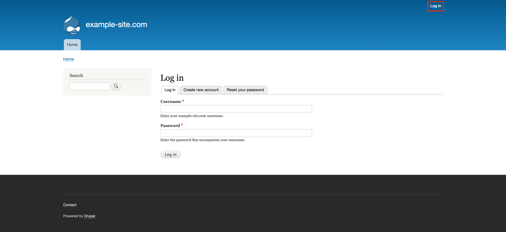

---
author:
  name: Linode Community
  email: docs@linode.com
description: 'Deploy a Drupal website on Linode using One-Click Apps.'
keywords: ['drupal','one-click', 'cms']
license: '[CC BY-ND 4.0](https://creativecommons.org/licenses/by-nd/4.0)'
published: 2019-03-25
modified: 2019-03-25
modified_by:
  name: Linode
title: "Deploy Drupal with One-Click Apps"
contributor:
  name: Linode
external_resources:
 - '[Drupal 8 Official Documentation](https://www.drupal.org/docs/8)'
 - '[Getting Started with Drupal 8 Administration](https://www.drupal.org/docs/8/administering-a-drupal-8-site/getting-started-with-drupal-8-administration)'
---

## Drupal One-Click App

Drupal is a content management system (CMS) designed for building custom websites for personal and business use. Built for high performance and scalability, Drupal provides the necessary tools to create rich, interactive "community" websites with forums, user blogs, and private messaging. Drupal also has support for personal publishing projects and can power podcasts, blogs, and knowledge-based systems, all within a single, unified platform.

In addition to the core infrastructure, there are a number of freely available Drupal modules that allow administrators of Drupal sites to provide additional functionality, and a robust API makes it easy to enable these features. Furthermore, Drupal has an advanced theming engine that allows for a great amount of flexibility for displaying content.

### Deploy a Drupal One-Click App



The [Drupal Options](#drupal-options) section of this guide provides details on all available configuration options for this app.

### Drupal Options

You can configure your Drupal App by providing values for the following fields:

| **Field** | **Description** |
|:--------------|:------------|
| **Drupal admin password** | Password for your Drupal admin profile. *Required*. |
| **Drupal admin username** | Username for your Drupal admin user. *Required*. |
| **E-Mail for your Drupal account** | E-Mail address for your Drupal admin user. *Required*. |
| **Your SSH public key** | Your SSH public key. *Advanced Configuration* |
| **Domain** | Domain for your Drupal site. Note, if you have not added DNS records for your Drupal site's domain, read our [DNS Manager](/docs/platform/manager/dns-manager/) guide for more information. *Advanced Configuration* |

### Linode Options

After providing the app specific options, provide configurations for your Linode server:

| **Configuration** | **Description** |
|:--------------|:------------|
| **Select an Image** | Debian 9 is currently the only image supported by Drupal One-Click Apps. *Required* |
| **Region** | Choose the region where you would like your Linode to reside. If you’re not sure which to select, see our [How to Choose a Data Center](/docs/platform/how-to-choose-a-data-center) guide. You can also generate [MTR reports](/docs/networking/diagnostics/diagnosing-network-issues-with-mtr/) for a deeper look at the route path between you and a data center in each specific region. *Required* |
| **Linode Plan** | Select a Linode plan. Drupal is an extremely flexible CMS that can be supported on any size Linode, but we suggest you deploy your Drupal app on a Linode plan that reflects how much content you plan on featuring as well as how much traffic you expect for your site. *Required* |
| **Linode Label** | Give your Linode a label. This is a name to help you easily identify it within the Cloud Manager’s Dashboard. |
| **Root Password** | Create a root password for your Linode in the Root Password field. This password must be provided when you log in to your Linode via SSH. It must be at least 6 characters long and contain characters from two of the following categories: lowercase and uppercase case letters, numbers, and punctuation characters. *Required* |

When you've provided all required Linode Options, click on the **Create** button. **Your Drupal app will complete installation anywhere between 2-5 minutes after your Linode has finished provisioning**.

### Getting Started After Deployment

After Drupal has finished installing, you will be able to access your Drupal site by copying your Linode's IPv4 address and entering it in the browser of your choice. To find your Linode's IPv4 address:

1. Click on the **Linodes** link in the sidebar. You will see a list of all your Linodes.

1. Find the Linode you just created when deploying your app and select it.

1. Navigate to the **Networking** tab.

1. Under the **IPv4** heading, you will find your IPv4 address listed under the **Address** column.

1. Copy and paste the IPv4 address into a browser window. You should see the Drupal welcome page appear.

    Once you have accessed your Drupal site via the browser, you can log in to your Drupal site using the admin credentials you created when deploying your One-Click Drupal App and begin configuring your site.

    

### Software Included

The Drupal One-Click App will install the following required software on your Linode:

| **Software** | **Description** |
|:--------------|:------------|
| **MySQL Server** | Database |
| **PHP 7** | Drupal is written in PHP and requires PHP to operate. |
| **Apache HTTP Server** | Web Server used to serve the Drupal site|
| **Drush** | A command line shell for Drupal |
| **Drupal 8** | Content management system |