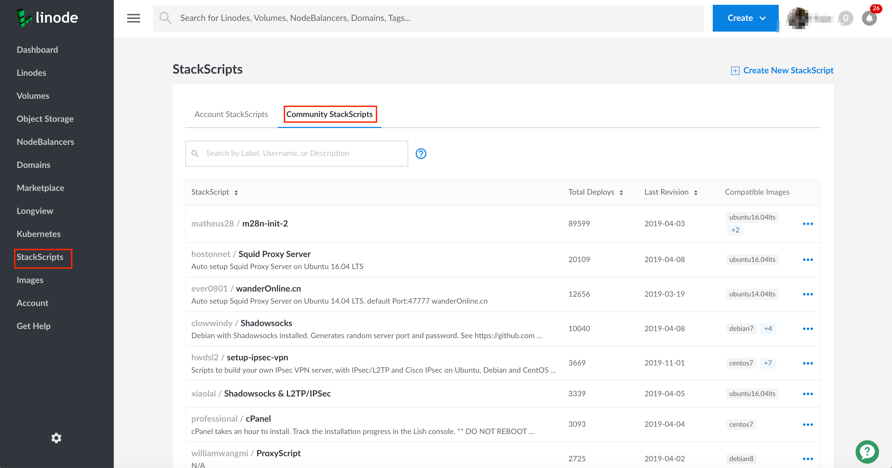
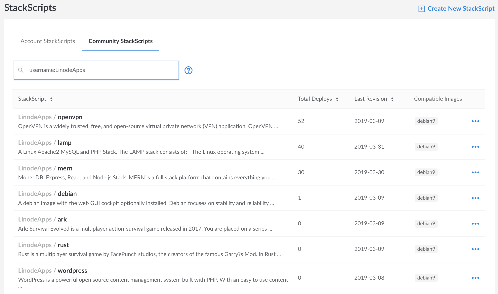
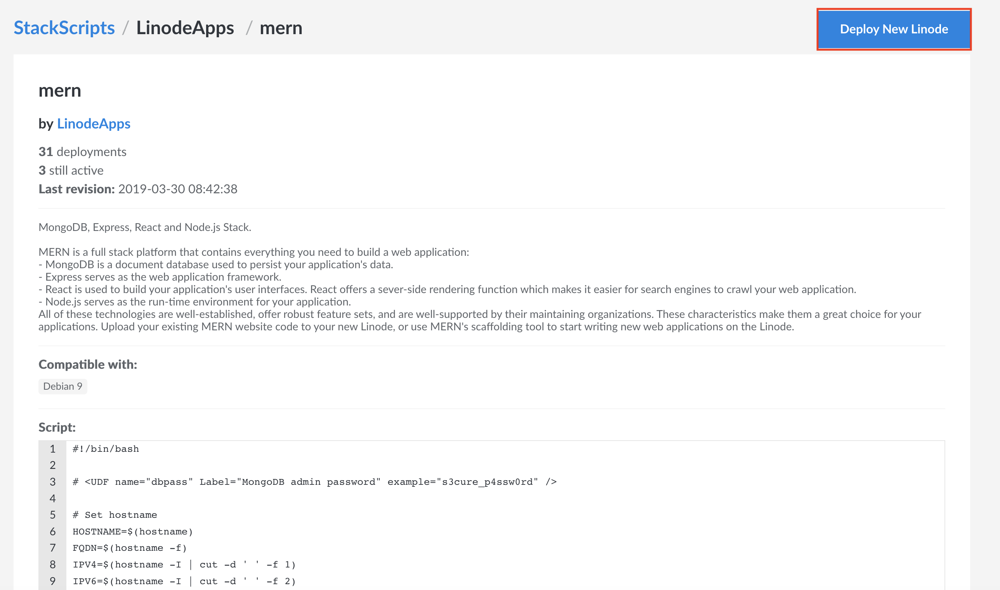

---
author:
  name: Linode
  email: docs@linode.com
description: 'Create custom instances and automate deployment with StackScripts.'
og_description: 'Create custom instances and automate deployment with StackScripts.'
keywords: ["automation", "deploy", "cloud", "custom instance", "scripts"]
license: '[CC BY-ND 4.0](https://creativecommons.org/licenses/by-nd/4.0)'
modified: 2020-04-22
modified_by:
  name: Linode
published: 2020-04-22
title: How to Automate Deployment with StackScripts
h1_title: Automating a Deployment with StackScripts
external_resources:
  - '[StackScript Community Library](http://linode.com/stackscripts)'
---

[StackScripts](http://linode.com/stackscripts/) provide Linode users with the ability to automate the deployment of custom systems on top of the default Linux distribution images. Linodes deployed with a StackScript run the script as part of the first boot process. This guide explains how to deploy a Linode using StackScripts.

## Introduction

StackScripts are usually Bash scripts, stored in the Linode Cloud Manager, and can be accessed when you deploy a Linode. During the first boot job of the newly created disks, the StackScript runs using any variable you may have added, and executes the scripted commands.
You can deploy a Linode using one of the StackScripts that you created and these scripts are listed under **Account StackScripts**. For more information, see [Developing a StackScript](/docs/platform/stackscripts/developing-stackscripts/). You can also deploy a Linode using scripts listed under **Community StackScripts**, created by Linode and other community members which are made available publicly to other users. This guide provides instructions to deploy a MERN stack on Linode using *Community StackScripts*. However, the outlined steps are similar if you plan to use your personal *Account StackScripts*


There is no default logging when using a StackScript. Output is sent to the console.


## Deploying from a StackScript

For example, to deploy a WordPress server using **Community StackScripts** created by `LinodeApps`.
1.  Log in to your [Linode Cloud Manager](https://cloud.linode.com) account.

1.  At the top of the page, click **Create** and select **Linode**.

1.  Click the **StackScripts** link in the sidebar and click **Community StackScripts** tab in the **StackScripts** page.

       

1.  Type `username:LinodeApps` to search for StackScripts created by `LinodeApps` user. You can also search based on `Label` or `Description`.

    

1.  Select the StackScript with the label `mern` to deploy a MERN stack on Linode.

    
Check if the StackScript references another script in the `source <ssinclude StackScriptID="####"` line.

-  If yes, then verify that the script is still valid by typing `https://cloud.linode.com/stackscripts/####` in the browser. Where, `####` is the ID  assigned to the script that is being referenced and proceed to the next step. Else, an error that reads:
**The SSINCLUDE (####) is referencing an inactive or invalid StackScript.** appears when you try to deploy a Linode.

-  If no, then proceed to the next step.
    

1.  Click **Deploy New Linode**.
    

1.  Type the required **MangoDB admin password**, and other configuration options that are optional to deploy a new Linode.

Every StackScript uses a different set of variables to run the script.

1.  Choose the image to deploy a new Linode, in **Select an Image**. The images that are listed depend on the distributions that are set when the script is created.

1.  Choose the region where you would like your Linode to reside. If you're not sure which to select, see our [How to Choose a Data Center](/docs/platform/how-to-choose-a-data-center) guide. You can also generate [MTR reports](/docs/networking/diagnostics/diagnosing-network-issues-with-mtr/) for a deeper look at the route path between you and a data center in each specific region.

1. Select a Linode plan.

1.  Give your Linode a label. This is a name to help you easily identify it within the Cloud Manager's Dashboard. If desired, assign a tag to the Linode in the **Add Tags** field.

1. Create a root password for your Linode in the **Root Password** field. This password must be provided when you log in to your Linode via SSH. It must be at least 6 characters long and contain characters from two of the following categories:

    - lowercase and uppercase case letters
    - numbers
    - punctuation characters
1.  Click **Create**. You will be directed back to the *Linodes* page which will report the status of your Linode as it boots up. You can now use the Cloud Manager to:

    * Boot and shut down your Linode
    * Access monitoring statistics
    * Update your [billing](/docs/platform/billing-and-support/manage-billing-in-cloud-manager/) and [account](/docs/platform/manager/accounts-and-passwords-new-manager/) information
    * Add additional Linode services, like [Block Storage](/docs/platform/block-storage/how-to-use-block-storage-with-your-linode-new-manager/)
    * Open a [support](/docs/platform/billing-and-support/support-new-manager/) ticket and perform other administrative task.
