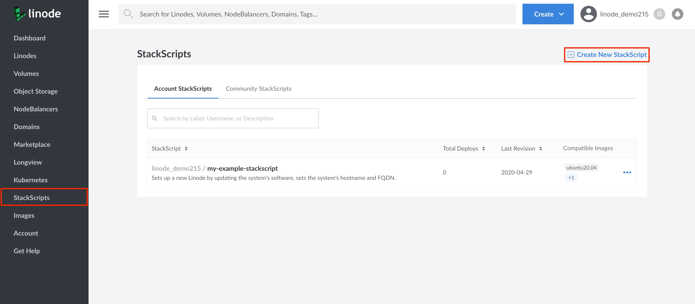
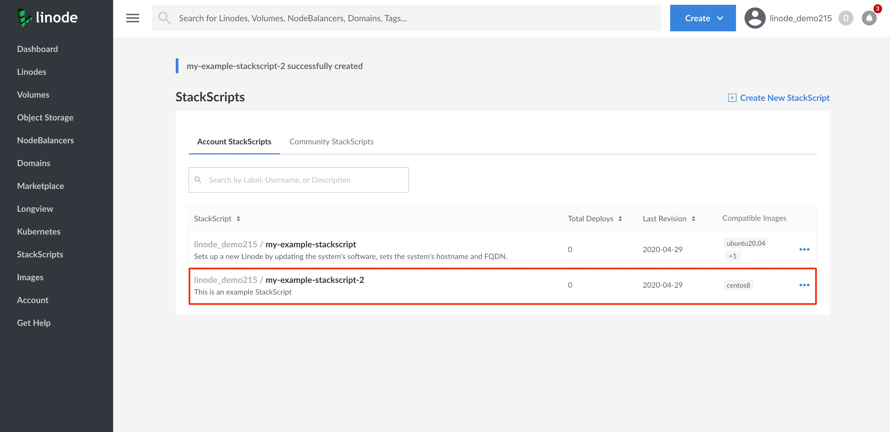

---
author:
  name: Linode
  email: docs@linode.com
description: 'Develop StackScripts  to create sustom Instances and automate deployments.'
og_description: 'Develop StackScripts  to create sustom Instances and automate deployments.'
keywords: ["automation", "develop", "cloud", "custom instance", "scripts"]
license: '[CC BY-ND 4.0](https://creativecommons.org/licenses/by-nd/4.0)'
modified: 2020-04-22
modified_by:
  name: Linode
published: 2020-04-22
title: How to Develop StackScripts
h1_title: Developing StackScripts
external_resources:
  - '[StackScript Community Library](http://linode.com/stackscripts)'
---

[StackScripts](http://linode.com/stackscripts/) provide Linode users with the ability to automate the deployment of custom systems on top of the default Linux distribution images. Linodes deployed with a StackScript run the script as part of the first boot process. This guide explains how StackScripts work, and provides examples on how to use them.

## Introduction

StackScripts are usually Bash scripts, stored in the Linode Cloud Manager, and can be accessed when you deploy a Linode. During the first boot job of the newly created disks, the StackScript will run using any variables you added, and will execute the scripted commands.

### Creating a New StackScript

1.  From the Cloud Manager's sidebar, click on the **StackScripts** link.

1.  Viewing the StackScripts page, click on the **Create New StackScript** link at the top of the page.

      

1.   On the **Create New StackScript** page, provide the required configurations to create your StackScript:

    | **Field**| **Description** |
    |:-----------------|:---------------------|
    | **StackScript Label** | The name with which to identify your StackScript. *Required*. |
    | **Description** | An overview of what your StackScript does. |
    | **Target Images** | The images that can run this StackScript. *Required*.|
    | **Script** | The body of the script. *Required*. |
    | **Revision Note** | A brief description of the changes made in this update of the StackScript. |

    
The file below displays an example of a simple script that executes some basic set up steps on a Linode. Review the example's comments for details on what each line of the script does.


#!/bin/bash
# This block defines the variables the user of the script needs to provide
# when deploying using this script.
#
#
#<UDF name="hostname" label="The hostname for the new Linode.">
# HOSTNAME=
#
#<UDF name="fqdn" label="The new Linode's Fully Qualified Domain Name">
# FQDN=

# This sets the variable $IPADDR to the IP address the new Linode receives.
IPADDR=$(/sbin/ifconfig eth0 | awk '/inet / { print $2 }' | sed 's/addr://')

# This updates the packages on the system from the distribution repositories.
apt-get update
apt-get upgrade -y

# This section sets the hostname.
echo $HOSTNAME > /etc/hostname
hostname -F /etc/hostname

# This section sets the Fully Qualified Domain Name (FQDN) in the hosts file.
echo $IPADDR $FQDN $HOSTNAME >> /etc/hosts


    

1.  Click **Save** when you are done. You can always edit the script later.

1. You will be brought back to the **StackScripts** page, where your new StackScript will be visible and ready to use with a new Linode deployment.

    
To deploy a new Linode with your new StackScript, follow the steps in the [Deploying a StackScript](/docs/platform/stackscripts/deploying-stackscripts/#deploying-from-a-stackscript) guide.
    

    

## StackScript Use Cases

This section contains information on common use cases for StackScripts.

### Calling StackScripts Recursively

StackScripts can call other StackScripts from the library at runtime. This functionality reduces the need to write duplicate code for multiple scripts. For example, the Linode [StackScript Bash Library](https://cloud.linode.com/stackscripts/1) is a set of functions that perform various tasks. The script creates the functions but does not run them. A new StackScript can import the Bash Library and then execute functions from it. This reduces the size and time-to-write of all StackScripts using the functions built into the library script.

In another example use case for linked StackScripts, you could create a StackScript that updates all software packages on the system. You would most likely want to perform this function on all new Linodes. You could then create a StackScript to build a web server that integrates into the current cluster. Rather than rewrite the commands to update the system,you can call the previous StackScript.

Let’s then say that some of this web servers run a CMS, like WordPress. You can create a StackScript which invokes the web server script, removing the need to rewrite the commands to install the web server software or update the system.

The syntax to pull another StackScript is:

    <ssinclude StackScriptID="[NUMBER]">

This downloads the StackScript on the Linode as `ssinclude-[NUMBER]`. To download and run the script (assuming it's written as a Bash script) use:

    source <ssinclude StackScriptID="[NUMBER]">

If you're scripting in another language, execute the script on a second line, as seen below:

    <ssinclude StackScriptID="[NUMBER]">
    ./ssinclude-[NUMBER]

A great example of this use case is the [StackScript Bash Library](https://cloud.linode.com/stackscripts/1), created by Linode. This script contains several useful functions to perform common tasks such as updating software and installing Apache, MySQL,etc. Run on its own it does nothing to alter your system. Importing the Bash Library script saves time in your own StackScripts.

### Demonstrating or Distributing Software

If you develop software, you can use StackScripts to deploy a demonstration instance of the software. The resulting system may not need to be particularly durable or be fully configured. With a StackScript for demonstrating software, you can let users experience and test the software while giving full control over the deployment. This same kind of procedure with minimal modification may also be an easy way to distribute the software itself. These StackScripts have to be generic so that other users can deploy from this StackScript without complication.

### Deploying Appliances and Cluster Instances

If your deployment includes function-specific *appliance-type* instances, you may want to explore using StackScripts to help manage these nodes, such as job-processing instances.

Application clusters are similar. If your architecture includes some sort of *cluster*, you may be able to automate the deployment of a new cluster-member by using StackScripts to configure the instance. Here, StackScripts, in combination with the API, helps you to elastically automate deployment and management of a cluster.

## Developing StackScripts

The only requirements to run a StackScript are that the first line of the script should contain a shebang such as `#!/bin/bash` and the interpreter specified in the shebang should be installed in the Linode base image you are deploying. While `Bash` is an obvious choice for StackScripts, you may choose any language or system.

**Community StackScripts**, are scripts created by Linode and other community members which are made available publicly to other users. Depending on the type of the script you develop, you may consider sharing your script in this library so that others may deploy instances using the script.

### Bootstrapping StackScripts

If you have an existing deployment script, you can use StackScripts to deploy instances with this script. Consider the following methods for *bootstrapping* one script with StackScripts:


#!/bin/bash

wget http://example.com/ --output-document=/opt/deployment-script.pl
chmod +x /opt/deployment-script.pl

./opt/deployment-script.pl



This approach is useful for bootstrapping scripts written in languages that are not included in the default instance template, as in the following example:


#!/bin/bash

if [ -f /etc/apt/sources.list ]; then
   apt-get upgrade
   apt-get -y install php5
elif [-f /etc/yum.conf ]; then
   yum -y install php
elif [-f /etc/pacman.conf ]; then
   pacman -Sy
   pacman -S --noconfirm pacman
   pacman -S --noconfirm php
else
   echo "Your distribution is not supported by this StackScript"
   exit
fi

wget http://example.com/ --output-document=/opt/deployment-script.php
chmod +x /opt/deployment-script.php

./opt/deployment-script.php



If you do not want to rely on an existing external server to host your scripts for download, you can embed the bootstrapped script in the StackScript. Consider the following example:


#!/bin/bash

if [ -f /etc/apt/sources.list ]; then
   apt-get upgrade
   apt-get -y install php5
elif [-f /etc/yum.conf ]; then
   yum -y install php
elif [-f /etc/pacman.conf ]; then
   pacman -Sy
   pacman -S --noconfirm pacman
   pacman -S --noconfirm php
else
   echo "Your distribution is not supported by this StackScript"
   exit
fi

cat >/opt/deployment-script.php <<EOF
#!/usr/bin/php
<?php print('Hello World!'); ?>
EOF

chmod +x /opt/deployment-script.php

./opt/deployment-script.php



### Using StackScripts from the Linode API

The [Linode API](http://www.linode.com/api/index.cfm) contains support for managing StackScripts and deploying instances with StackScripts. Consider the documentation of the following Linode API methods:

-   [avail.stackscripts](https://www.linode.com/api/utility/avail.stackscripts)
-   [stackscript.create](https://www.linode.com/api/stackscript/stackscript.create)
-   [stackscript.list](https://www.linode.com/api/stackscript/stackscript.list)
-   [stackscript.update](https://www.linode.com/api/stackscript/stackscript.update)
-   [linode.disk.createfromstackscript](https://www.linode.com/api/linode/linode.disk.createfromstackscript)

    
To create a disk with `linode.disk.createfromstackscript`, you need to first create a configuration profile and attach the disk to the profile before you can boot and run the StackScript.


### Variables and UDFs

The StackScript system provides a basic markup specification that interfaces with the Linode deployment process so that users can customize the behavior of a StackScript on a per-deployment basis. These `UDF` tags, when processed, insert variables and values into the script's environment.

The UDF tags are explained in the table below:

|Label    | Description           | Requirements
|:--------|:----------------------|:---------
|name     | The variable name     | Alphanumeric, len <64, must be unique
|label    | The question to ask   | Text 0-255
|default  | The default value     | If not specified then this UDF is required
|example  | Example input         |
|oneof    | A comma separated list of values| Optional
|manyof   | A comma separated list of values| Optional

Here is an example implementation of the UDF variables. The UDF tags are commented out to prevent execution errors, as the StackScript system parses the tags without removing them:


# [...]
# <UDF name="var1" Label="A question" default="" example="Enter something here." />
# <UDF name="var2" Label="Pick one of" oneOf="foo,bar" example="Enter something here." />
# <UDF name="var3" Label="A question" oneOf="foo,bar" default="foo" />
# <UDF name="var4" Label="Pick several from" manyOf="foo,bar" default="foo,bar" />
# [...]



If you would like to create a masked password input field, use the word 'password' anywhere in the UDF name.


There are also a set of Linode created environmental variables that can be used for API calls or other tasks from within the script.

| Environment Variable               | Description                                                                               |
|:-----------------------------------|:------------------------------------------------------------------------------------------|
| `LINODE_ID=123456`                 | The Linode's ID number                                                                    |
| `LINODE_LISHUSERNAME=linode123456` | The Linode's full lish-accessible name                                                    |
| `LINODE_RAM=1024`                  | The RAM available on this Linode's plan                                                   |
| `LINODE_DATACENTERID=6`            | The ID number of the data center containing the Linode. See our API for more information. |

If you do not want to use the StackScript system to set your environment variables, you might consider hosting files with settings on a different system.For example, use the following fragment:


# [...]
IPADDR=$(/sbin/ifconfig eth0 | awk '/inet / { print $2 }' | sed 's/addr://')

wget http://example.com/base.env --output-document=/tmp/base.env
wget http://example.com/$IPADDR.env --output-document=/tmp/system.env

source /tmp/base.env
source /tmp/system.env
# [...]



Make sure that there are files accessible through `HTTP` hosted on the `example.com` domain for both basic environment files such as `base.env` and machine specific files such as `[ip-address].env` before launching this StackScript. Also consider the possible security implications of allowing any file with sensitive information regarding your deployment to be publicly accessible.
