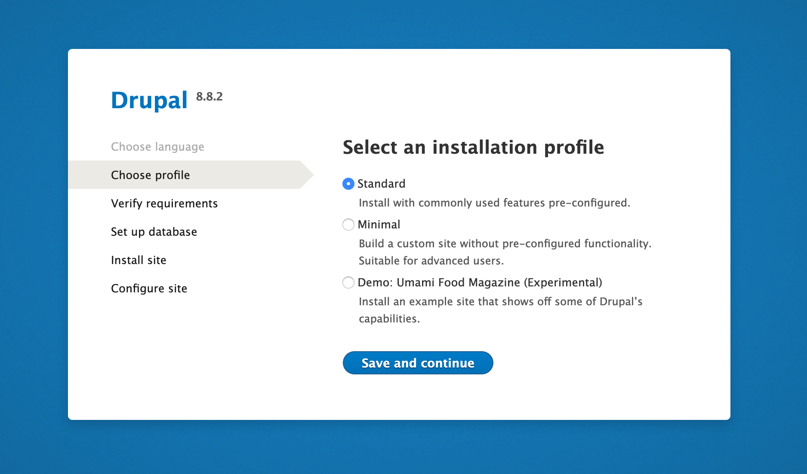
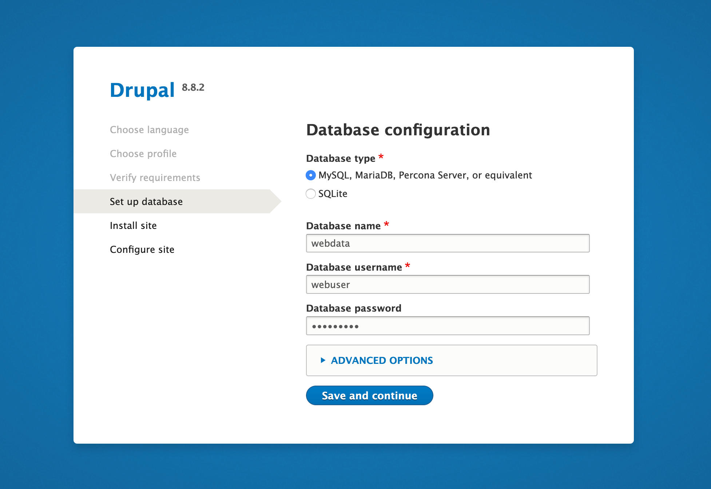
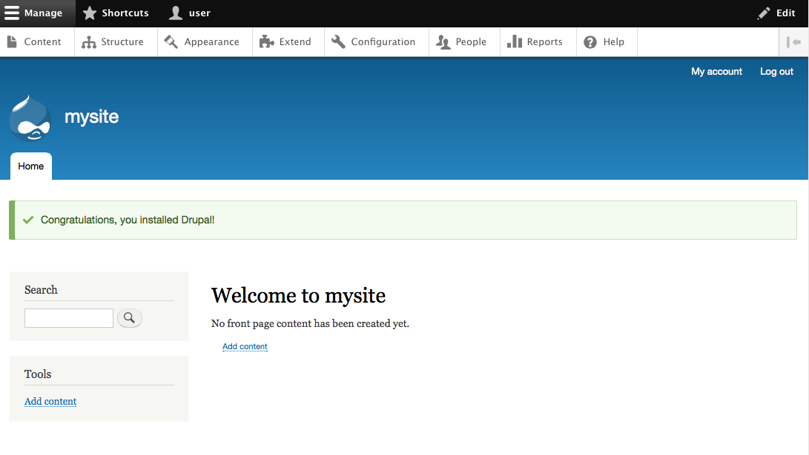

---
author:
    name: Linode
    email: docs@linode.com
description: 'Drupal 8 is the latest version of the popular Drupal content management system. This guide will show you how to install and configure the Drupal CMS on your CentOS 8 Linode so you can begin developing your own websites.'
keywords: ["drupal", "cms", "apache", "php", "content management system", "drupal 8", "centos 8"]
license: '[CC BY-ND 4.0](https://creativecommons.org/licenses/by-nd/4.0)'
modified_by:
    name: Linode
published: 2020-02-18
title: How to Install and Configure Drupal on CentOS 8
h1_title: Install and Configure Drupal on CentOS 8
---

Drupal 8 is the latest version of the popular [Drupal](https://www.drupal.org/) content management system. This guide demonstrates how to install Drupal 8 on your Linode running CentOS 8.

## Before You Begin

1.  Familiarize yourself with our [Getting Started](/docs/getting-started) guide and complete the steps for [setting your Linode's hostname](/docs/getting-started/#set-the-hostname) and [timezone](/docs/getting-started/#set-the-timezone).

1. Follow our [Securing Your Server](/docs/security/securing-your-server) guide to [create a standard user account](/docs/security/securing-your-server/#add-a-limited-user-account), [harden SSH access](/docs/security/securing-your-server/#harden-ssh-access), [remove unnecessary network services](/docs/security/securing-your-server/#remove-unused-network-facing-services) and [create firewall rules](/docs/security/securing-your-server/#configure-a-firewall) for your web server; you may need to make additional firewall exceptions for your specific application.

    

1.  Install and configure a [LAMP stack on CentOS 8](/docs/web-servers/lamp/how-to-install-a-lamp-stack-on-centos-8/)

1.  Install the `wget` and `tar` utilities. You will need this in a later section to install the Drupal 8 core.

        sudo yum install wget -y && sudo yum install tar

## Download and Prepare Drupal 8

1. Navigate to your site's document root. If you installed and configured your Apache server using our [LAMP stack on CentOS 8](/docs/web-servers/lamp/how-to-install-a-lamp-stack-on-centos-8/) guide, your document root should be located in the `/var/www/html/example.com/public_html/` directory. Replace `example.com` with your own document root path's name.

        cd /var/www/html/example.com

1. Download the Drupal 8 tarball. As of writing this guide, Drupal 8.8.2 is the latest version. See [Drupal's download page](https://www.drupal.org/project/drupal) for their latest core tarball.

        sudo wget http://ftp.drupal.org/files/projects/drupal-8.8.2.tar.gz

    
Ensure that the version number matches the Drupal 8 version you wish to download.


1.  Extract the downloaded tarball's contents into your site's document root:

        sudo tar -zxvf drupal-8.*.tar.gz --strip-components=1 -C public_html

1.  Drupal depends on a PHP graphics library called GD. Install GD and other dependencies:

        sudo yum install -y php php-{cli,mysqlnd,json,opcache,xml,mbstring,gd,curl}

1. Create your Drupal 8 installation's `settings.php` file from the default settings file. This file will be configured when you run through Drupal's web configuration in the [Drupal First Start](#drupal-first-start) section.

        sudo cp /var/www/html/example.com/public_html/sites/default/default.settings.php /var/www/html/example.com/public_html/sites/default/settings.php

1.  Enforce [trusted hostnames](https://www.drupal.org/node/2410395) with those that users will access your site from. With the text editor of your choice, edit your `settings.php` file replacing the values with your own site's URL(s).

    
$settings['trusted_host_patterns'] = array(
  '^www\.example\.com$',
  '^example\.com$',
  );



    
`trusted_host_patterns` also accepts IP addresses or localhost.


## Configure Apache 2.4

1.  Drupal 8 enables [Clean URLs](https://www.drupal.org/getting-started/clean-urls) by default so Apache's rewrite module is enabled on CentOS. However, you will need to set directory permissions and SELinux labels:

        sudo yum install policycoreutils-python-utils
        sudo semanage fcontext -a -t httpd_sys_rw_content_t "/var/www/html/example.com/public_html(/.*)?"
        sudo semanage fcontext -a -t httpd_sys_rw_content_t '/var/www/html/example.com/public_html/sites/default/settings.php'
        sudo semanage fcontext -a -t httpd_sys_rw_content_t '/var/www/html/example.com/public_html/sites/default/files'
        sudo restorecon -Rv /var/www/html/example.com/public_html
        sudo restorecon -v /var/www/html/example.com/public_html/sites/default/settings.php

2.  Then specify the rewrite conditions for your Drupal site's document root in Apache's configuration file.
    If you installed and configured your Apache server using [LAMP stack on CentOS 8](/docs/web-servers/lamp/how-to-install-a-lamp-stack-on-centos-8/) guide, the configuration file for your site is located at `/etc/httpd/conf.d/example.com.conf`.

    
<Directory /var/www/html/example.com/public_html>
     Options Indexes FollowSymLinks
     AllowOverride All
    Require all granted
</Directory>



3.  Change the ownership of your site's document root from `root` to `apache`. This allows you to install modules and themes, and to update Drupal, all without being prompted for FTP credentials.

        sudo chown apache:apache -R /var/www/html/example.com/public_html

4.  Restart Apache so all your changes are applied.

        sudo systemctl restart httpd

## Drupal First Start

1.  Go to your Linode's domain or IP address in a web browser. This will show you the first step of Drupal 8's web configuration. Choose your language and proceed to the next page.

    

2.  Choose whether you want a Standard or Minimal installation profile.

    

3.  Complete the database configuration using the DB name, username and password you created when [setting up your LAMP stack](/docs/web-servers/lamp/install-lamp-stack-on-centos-8) with a MySQL or MariaDB database.

    

    
If you forgot the name of your database, log back in to MySQL or MariaDB with: `mysql -u root -p` and enter: `show databases;`.


4.  After Drupal 8 installs your site, you'll be shown a site configuration page where you must create the admin user for your website. Do not use the same password that you used for your database.

    

    Next, you'll be taken to the administrative dashboard which will say that Drupal 8 was installed successfully.

    

5.  Now that Drupal 8 is finished writing to `settings.php` and `services.yaml`, you can restore their default permissions:

        sudo chmod 644 /var/www/html/example.com/public_html/sites/default/{settings.php,services.yml}

## Where to Go From Here

Drupal has a significant amount of documentation for [security best practices](https://www.drupal.org/security/secure-configuration) to consider when hardening any Drupal server. There is also extensive [community documentation](https://www.drupal.org/documentation) and there are multiple ways of [participating in the Drupal community](https://www.drupal.org/community).
