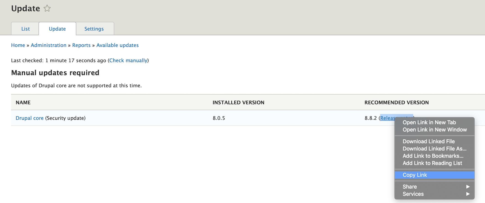
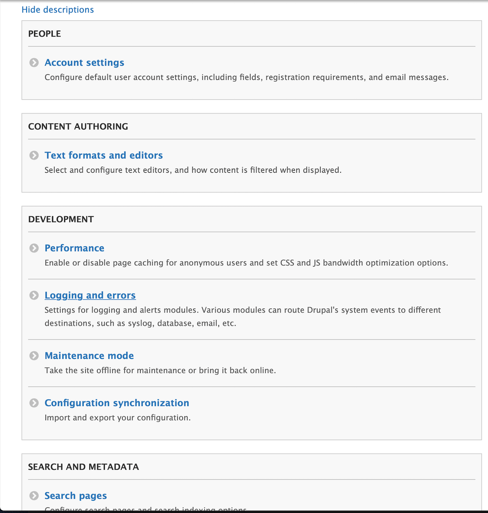

---
author:
    name: Linode
    email: docs@linode.com
description: 'This guide will show you how to update and secure an installation of Drupal 8 CMS on your Linode running Ubuntu or Debian.'
keywords: ["drupal", "cms", "apache", "php", "content management system", "drupal 8", "update"]
license: '[CC BY-ND 4.0](https://creativecommons.org/licenses/by-nd/4.0)'
modified: 2020-02-21
modified_by:
    name: Linode
published: 2020-02-21
title: How to Update and Secure Drupal 8 on CentOS 8
h1_title: Updating and Securing Drupal 8 on Centos 8
---

Drupal 8 is the latest version of the popular [Drupal](https://www.drupal.org/) content management system. While a simple feature for incremental updates is included in version 8.1, manual core updates are required for all preceding versions. This guide demonstrates how to manually install an incremental Drupal 8 update on your Linode. This guide assumes you have a functional Drupal 8 installation running a [LAMP stack](/docs/web-servers/lamp/how-to-install-a-lamp-stack-on-centos-8/) and CentOS 8.

## Before You Begin

1. Complete all the steps in the [Install and Configure Drupal 8 on CentOS 8](/docs/websites/cms/drupal/how-to-install-and-configure-drupal-on-centos-8/) guide.

1. If you followed the [Install and Configure Drupal 8 on CentOS 8](/docs/websites/cms/drupal/how-to-install-and-configure-drupal-on-centos-8/) guide, your site's document root should be in the `/var/www/html/example.com/` directory, where `example.com` is your own site's domain name. You can list all your directories in `/var/www/html` to verify the locations of your site's document root.

        ls /var/wwww/html/

1. Update your CentOS 8 system if you have not yet done so while you completed the Install and Configure Druapl 8 on CentOS 8 guide.

        sudo yum update

    

## Create Backups

In this section, you will create an archive of your Drupal site's files and store the archive in a `backups` directory. If needed, you could extract the compressed files in your backup archive to restore a specific state of your site.

1. Create a `backups` directory in your site's document root to store any backups you make of your Drupal site.

        sudo mkdir /var/www/html/example.com/backups

1. Create an archive of your existing site files and move it into the `backups` directory. Ensure you replace `example.com` with your own site's domain name.

        cd /var/www/html/example.com/public_html
        sudo tar -cvzf example.com-BCKP-$(date +%Y%m%d).tar.gz ./
        sudo mv -v example.com-BCKP-*.tar.gz ../backups

    
This process can also be scripted and run on a regular basis using [cron](/docs/tools-reference/tools/schedule-tasks-with-cron/).
    

## Download Updates

You are now ready to check your Drupal system for available updates. Once you have identified the necessary updates, you will download them as an archive to your Linode.

1.  Log in to your Drupal site and navigate to the [Admin Toolbar](https://www.drupal.org/project/admin_toolbar). Click on **Reports** and then on **Available updates**.

    
If **Available updates** is not listed, enable the [Update Manager](https://www.drupal.org/docs/8/core/modules/update-manager) module by navigating to the **Extend** menu item in the Admin Toolbar. See [Drupal's documentation](https://www.drupal.org/docs/8/extending-drupal-8/installing-drupal-8-modules#s-step-2-enable-the-module) for more details on enabling modules.


1.  Right click the link under the **RECOMMENDED VERSION** heading and copy the link address and paste it somewhere you can access later.

    

    
If you receive an error when your Drupal 8 installation checks for available updates, it may be having issues communicating with the Drupal website to see there are updates. You can check your site's recent log messages, by navigating to **Reports** and selecting **Recent log messages** to further investigate the issue.

If your CentOS installation is running in enforcing mode, ensure you are allowing httpd to make network connections. One way to do this is to set the corresponding SELinux boolean to `true`:

    sudo setsebool httpd_can_network_connect true

Also, ensure that firewalld is allowing `https` traffic:

    sudo firewall-cmd --zone=public --add-service=https
    

1.  Connect to your Linode over SSH:

        ssh user@192.0.2.0

1.  Navigate to your site's document root directory. Download the Drupal core archive using `wget` and pasting the link address you copied from Step 2:

        cd /var/www/html/example.com
        sudo wget https://ftp.drupal.org/files/projects/drupal-8.8.2.tar.gz

## Upgrade Your Site

###  Put the Site into Maintenance Mode

1.  Back in your browser navigate to **Configuration**, **Development**, then **Maintenance mode**.

    

2.  Check the box next to "Put site into maintenance mode." Enter a message if desired, and click **Save Configuration**.

    

### Replace System Files

1.  While in the site's `public_html` folder on your Linode, remove existing files and folders except `sites` and `profiles`:

        sudo rm -ifr autoload.php composer.* example.gitignore index.php LICENSE.txt README.txt robots.txt update.php web.config && sudo rm -ifr core/ modules/ vendor/ themes/

2.  Go up one directory, then expand the update into your `public_html` folder. Replace `drupal-8.1.1.tar.gz` with the current update:

        cd ..
        sudo tar -zxvf drupal-8.8.2.tar.gz --strip-components=1 -C public_html

3.  From a browser on your local machine, navigate to `example.com/update.php`:

    
If `update.php` does not load or returns a 403 Forbidden error, you can try to change the ownership and permissions of the newly expanded files:

    chgrp www-data /var/www/html/example.com/public_html/sites/default/files
    chmod 775 /var/www/html/example.com/public_html/sites/default/files
    chmod 757 /var/www/html/example.com/public_html/sites/default/settings.php


4.  Follow the prompts to continue the update.

5.  If installing additional modules or configuring additional security settings, proceed to the *[Additional Security](/docs/websites/cms/update-and-secure-drupal-8-on-ubuntu/#additional-security)* section below. Return to Step 6 once those configurations are complete.

6.  Rebuild the site's cache by clicking **Configuration** in the Admin Toolbar, then **Performance** under Development. Click **Clear all caches**.

7.  Click **Reports** in the Admin Toolbar, then **Status report**.

8.  From your Linode, open `/var/www/html/example.com/public_html/sites/default/settings.php` and confirm that `$settings[‘update_free_access’] = FALSE;`.

9.  If everything looks good, take the site out of maintenance mode *[described above](/docs/websites/cms/update-and-secure-drupal-8-on-ubuntu/#put-the-site-into-maintenance-mode)* by unchecking the box next to "Put site into maintenance mode."

## Additional Security

1.  Increase password security by adding the following to `services.yml`:

    
# Increase the number of password hash iterations. Minimum = 7; Maximum = 30; Default = 16
  services:
  password:
  class: Drupal\Core\Password\PhpassHashedPassword
  arguments: [19]



      
You may need to add write permission to this file before you can edit it:

chmod u+w /var/www/html/example.com/public_html/sites/default/services.yml


2. Consider installing additional security modules from the [Drupal Project Module](https://www.drupal.org/project/project_module):
    * [Secure Login](https://www.drupal.org/project/securelogin) enforces secure authenticated session cookies
    * [Password Policy](https://www.drupal.org/project/password_policy): Define a user password policy
    * [Security Review](https://www.drupal.org/project/security_review): Automated security testing
