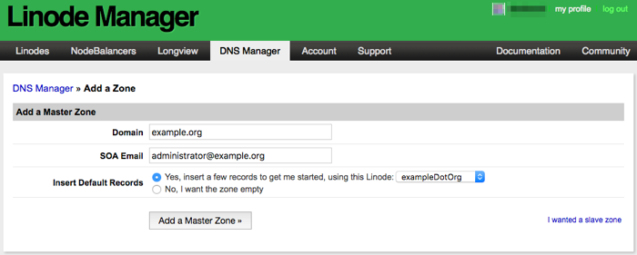
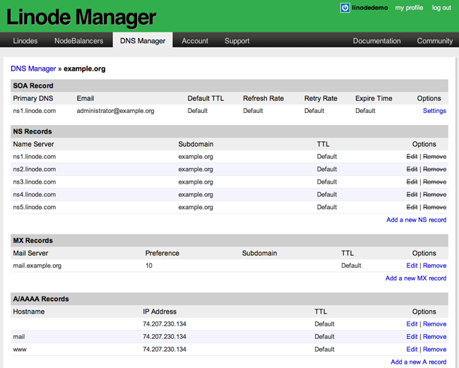
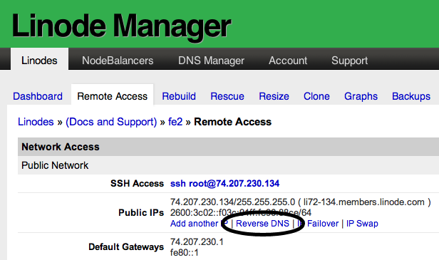
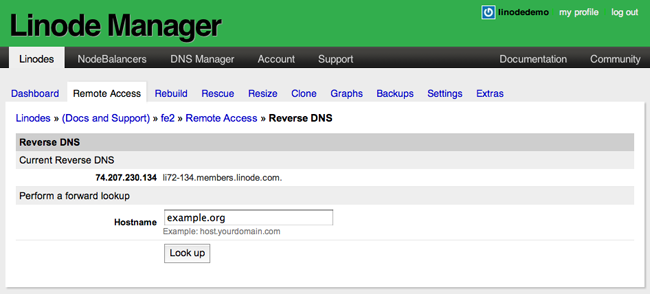

---
author:
  name: Linode
  email: docs@linode.com
description: 'Our guide to hosting a website on your Linode.'
keywords: ["linode guide", "hosting a website", "website", "linode quickstart guide"]
license: '[CC BY-ND 4.0](https://creativecommons.org/licenses/by-nd/4.0)'
aliases: ['hosting-website/','websites/hosting-a-website/']
modified: 2018-08-03
modified_by:
  name: Linode
published: 2012-03-13
title: Host a Website on Ubuntu 18.04
---

Now that you've installed Linux and secured your Linode, it's time to start *doing* stuff with it. In this guide, you'll learn how to host a website. Start by installing a web server, database, and PHP - a popular combination which is commonly referred to as the LAMP stack (Linux, Apache, MySQL, and PHP). Then create or import a database, upload files, and add DNS records. By the time you reach the end of this guide, your Linode will be hosting one or more websites!

This guide is intended for small and medium-size websites running on WordPress, Drupal, or another PHP content management system. If your website doesn't belong in that category, you'll need to assess your requirements and install custom packages tailored for your particular requirements.


This guide is written for a non-root user. Commands that require elevated privileges are prefixed with `sudo`. If you're not familiar with the `sudo` command, check our [Users and Groups](/docs/tools-reference/linux-users-and-groups/) guide.


## Web Server

Hosting a website starts with installing a *web server*, an application on your Linode that delivers content through the Internet. This section will help you get started with *Apache*, the world's most popular web server. For more information about Apache and other web servers, see our [guides on web servers](/docs/web-servers/).

If you are using Ubuntu 18.04, instead of installing each component separately, use Tasksel to install a LAMP stack on your Linode. When Tasksel completes, skip the installation steps in each section below and continue on to the configuration steps of each part of the stack:

    sudo tasksel install lamp-server

### Install Apache

Check for and install all system updates, and install Apache on your Linode:

    sudo apt update && sudo apt upgrade
    sudo apt install apache2

Your Linode will download, install, and start the Apache web server.

### Optimize Apache for a Linode 2GB

Installing Apache is easy, but if you leave it running with the default settings, your server could run out of memory. That's why it's important to optimize Apache *before* you start hosting a website on your Linode.

These guidelines are designed to optimize Apache for a **Linode 2GB**, but you can use this information for any size Linode. These values are based on the amount of memory available, so if you have a Linode 4GB, multiply all of the values by 2 and use those numbers for your settings.

1.  Make a copy of Apache's configuration file. You can restore the duplicate (`apache2.backup.conf`) if anything happens to the configuration file:

        sudo cp /etc/apache2/apache2.conf /etc/apache2/apache2.backup.conf

1.  Open Apache's configuration file for editing:

        sudo nano /etc/apache2/apache2.conf

    This will open the file in `nano`, but you may use whatever text editor you are comfortable with.

1.  Add this section to the end of the file:

    
KeepAlive Off

   ...

   <IfModule mpm_prefork_module>
       StartServers 4
       MinSpareServers 20
       MaxSpareServers 40
       MaxClients 200
       MaxRequestsPerChild 4500
   </IfModule>


1.  Save the changes to Apache's configuration file. If you are using `nano`, do this by pressing **CTRL+X** and then **Y**. Press **ENTER** to confirm.

1.  Restart Apache to incorporate the new settings:

        sudo systemctl restart apache2

You've successfully optimized Apache for your Linode, increasing performance and implementing safeguards to prevent excessive resource consumption. You're almost ready to host websites with Apache.

### Configure Name-based Virtual Hosts

Now that Apache is optimized for performance, it's time to starting hosting one or more websites. There are several possible methods of doing this. In this section, you'll use *name-based virtual hosts* to host websites in your home directory.


You should *not* be logged in as `root` while executing these commands. To learn how to create a new user account and log in as that user, see [Add a Limited User Account](/docs/security/securing-your-server/#add-a-limited-user-account).


1.  Disable the default Apache virtual host:

        sudo a2dissite *default

1.  Navigate to your /var/www/html directory:

        cd /var/www/html

1.  Create a folder to hold your website and its files, logs, and backups, replacing `example.com` with your domain name:

        sudo mkdir -p /var/www/html/example.com/{public_html,log,backups}

1.  Create the virtual host file for your website. Replace the `example.com` in `example.com.conf` with your domain name:

        sudo nano /etc/apache2/sites-available/example.com.conf

1.  Create a configuration for your virtual host. Copy the basic settings in the example below and paste them into the virtual host file you just created. Replace all instances of `example.com` with your domain name:

    
# domain: example.com
# public: /var/www/html/example.com/public_html/

<VirtualHost *:80>
  # Admin email, Server Name (domain name), and any aliases
  ServerAdmin webmaster@example.com
  ServerName  example.com
  ServerAlias www.example.com

  # Index file and Document Root (where the public files are located)
  DirectoryIndex index.html index.php
  DocumentRoot /var/www/html/example.com/public_html
  # Log file locations
  LogLevel warn
  ErrorLog  /var/www/html/example.com/log/error.log
  CustomLog /var/www/html/example.com/log/access.log combined
</VirtualHost>


1.  Save the changes to the virtual host configuration file by pressing **CTRL+X** and then pressing **Y**. Press **ENTER** to confirm.

1.  Enable your new website, replacing `example.com` with your domain name:

        sudo a2ensite example.com.conf

    This creates a symbolic link to your `example.com.conf` file in the appropriate directory for active virtual hosts.

1.  Reload to apply your new configuration:

        sudo systemctl reload apache2

1. Repeat Steps 1-8 for any other websites you want to host on your Linode.

You've configured Apache to host one or more websites on your Linode. After you [upload files](#upload-files) and [add DNS records](#add-dns-records) later in this guide, your websites will be accessible to the outside world.

## Database

Databases store data in a structured and easily accessible manner, serving as the foundation for hundreds of web and server applications. A variety of open source database platforms exist to meet the needs of applications running on your Linode. This section will help you get started with *MySQL*, one of the most popular database platforms. For more information about MySQL and other databases, see our [database reference guides](/docs/databases/).

### Install MySQL

1.  Install and automatically start the database MySQL server:

        sudo apt install mysql-server

1.  Secure MySQL using the `mysql_secure_installation` utility:

        sudo mysql_secure_installation

1.  The `mysql_secure_installation` utility appears. You will be prompted to:

    - Set up the `VALIDATE PASSWORD` plugin that checks the strength of password and allows the users to set only those passwords which are secure enough.

    - Set a password for `root`.

    - Remove anonymous users.

    - Disallow remote root logins.

    - Remove the test database.

    It is recommended that you answer `yes` to these options. You can read more about the script in the [MySQL Reference Manual](https://dev.mysql.com/doc/refman/5.7/en/mysql-secure-installation.html).

MySQL is now installed and running on your Linode.

### Optimize MySQL for a Linode 2GB

MySQL consumes a lot of memory when using the default configuration. To set resource constraints, edit the MySQL configuration file.

If you have a Linode larger than 2GB, modify these values while carefully watching for memory and performance issues.

1.  Open the MySQL configuration file for editing:

        sudo nano /etc/mysql/my.cnf

1.  If applicable, comment out all lines beginning with `key_buffer` by adding a `#` to each. This is a deprecated setting and we'll use the correct option instead.

1.  Add the following values:

    
[mysqld]
max_allowed_packet = 1M
thread_stack = 128K
max_connections = 75
table_open_cache = 32M
key_buffer_size = 32M


1.  Save the changes to MySQL's configuration file by pressing **CTRL+X** and then pressing **Y** and hitting **ENTER** to save.

1.  Restart MySQL to save the changes:

        sudo systemctl restart mysql

Now that you've edited the MySQL configuration file, you're ready to start creating and importing databases.

### Create a Database

The first thing you'll need to do in MySQL is create a *database*. If you already have a database that you'd like to import, skip to the section [Import a Database](#import-a-database).

1.  Log in using the MySQL root password:

        sudo mysql -u root -p

1.  Create a database, replacing `exampleDB` with your own database name:

        CREATE DATABASE exampleDB;

1.  Create a new user in MySQL and grant that user permission to access the new database, replacing `example_user` with your username, and `password` with your password:

        GRANT ALL ON exampleDB.* TO 'example_user' IDENTIFIED BY 'password';

    
MySQL usernames and passwords are only used by scripts connecting to the database. They do not need to represent actual user accounts on the system.


1.  Reload the grant tables and exit MySQL:

        FLUSH PRIVILEGES;
        quit

Now you have a new database that you can use for your website. If you don't need to import a database, skip to the [PHP section](#php).

### Import a Database

If you have an existing website, you may want to import an existing database in to MySQL. It's easy and it allows you to have an established website up and running on your Linode in a matter of minutes.

1.  Upload the database file to your Linode. See the instructions in the [Upload Files](#upload-files) section.

1.  Import the database, replacing `username` with your MySQL username and `database_name` with the database name you want to import to. You will be prompted for your MySQL password:

        mysql -u username -p database_name < FILE.sql

Your database will be imported into MySQL.

## PHP

PHP is a general-purpose scripting language that allows you to produce dynamic and interactive webpages. Many popular web applications and content management systems, like WordPress and Drupal, are written in PHP. To develop or host websites using PHP, install the base package and a couple of modules.

### Install PHP

1.  Install the base PHP package and the PHP Extension and Application Repository:

        sudo apt install php php-pear

1.  Add the MySQL support extension for PHP:

        sudo apt install php-mysql

1. Add the PHP module for the Apache 2 webserver:

        sudo apt install libapache2-mod-php

### Optimize PHP for a Linode 2GB

Enable logging and tune PHP for better performance. Pay attention to the `memory_limit` setting. It controls how much memory is allocated to PHP.

If you have a Linode larger than 2GB, increase the memory limit to a larger value, like 256M.

1.  Open the PHP configuration files:

        sudo nano /etc/php/7.2/apache2/php.ini

1.  Verify that the following values are set. All of the lines listed below should be uncommented. Be sure to remove any semicolons (`;`) at the beginning of the lines:

    
max_execution_time = 30
memory_limit = 128M
error_reporting = E_ALL & ~E_DEPRECATED & ~E_STRICT
display_errors = Off
log_errors = On
error_log = /var/log/php/php_errors.log



    
The 128M setting for `memory_limit` is a general guideline. While this value should be sufficient for most websites, larger websites and some web applications may require 256 megabytes or more.


1.  Save the changes by pressing `Control-X` and then `Y`. Hit `Enter` to confirm the changes.

1.  Create the `/var/log/php/` directory for the PHP error log:

        sudo mkdir -p /var/log/php

1.  Change the owner of the `/var/log/php/` directory to `www-data`:

        sudo chown www-data /var/log/php

1.  Restart Apache to load the PHP module:

        sudo service apache2 restart

Congratulations! PHP is now installed on your Linode and configured for optimal performance.

## Upload Files

You've successfully installed Apache, MySQL, and PHP. Now it's time to upload a website to your Linode. This is one of the last steps before you "flip the switch" and publish your website on the Internet.

1.  If you haven't done so already, download and install an SFTP capable client on your computer. We recommend using the [FileZilla](/docs/tools-reference/file-transfer/filezilla/) SFTP client. Follow the instructions in that guide to connect to your Linode.

1.  Upload your website's files to the `/var/www/html/example.com/public_html` directory. Replace `example.com` with your domain name.

    If you configured multiple name-based virtual hosts, don't forget to upload the files for the other websites to their respective directories.

If you're using a content management system like WordPress or Drupal, you may need to configure the appropriate settings file to point the content management system at the MySQL database.

## Test your Website

It's a good idea to test your website(s) before you add the DNS records. This is your last chance to check everything and make sure that it looks good before it goes live.

1.  Enter your Linode's IP address in a web browser (e.g., type `http://192.0.2.0` in the address bar, replacing the example IP address with your own). Your website should load in the web browser.

    
  If you have configured a firewall on your Linode, ensure your firewall rules allow traffic to your Apache web server. For more informatino on configuring firewall rules on Ubuntu, see [How to Configure a Firewall with UFW](/docs/security/firewalls/configure-firewall-with-ufw/).
    

1.  If you plan on hosting multiple websites, you can test the virtual hosts by editing the `hosts` file on your local computer. Check out the [Previewing Websites Without DNS](/docs/networking/dns/previewing-websites-without-dns/) guide for more information.

1.  Test the name-based virtual hosts by entering the domain names in the address bar of the web browser on a local device. Your websites should load in the web browser.

    
Remember to remove the entries for the name-based virtual hosts from your `hosts` file when you're ready to test the DNS records.


## Add DNS Records

Now you need to point your domain name(s) at your Linode. This process can take a while, so please allow up to 24 hours for DNS changes to be reflected throughout the Internet.

1.  Log in to the [Linode Manager](https://manager.linode.com).

1.  Click the **DNS Manager** tab.

1.  Select the **Add a domain zone** link. The form shown below appears:

    

1.  In the **Domain** field, enter your website's domain name in the **Domain** field.

1.  In the **SOA Email** field, enter the administrative contact email address for your domain.

1.  Click **Yes, insert a few records to get me started**.

1.  Click **Add a Master Zone**. Several DNS records will be created for your domain, as shown below:

    

1. Through your domain registrar (where you bought the domain), make sure that your domain name is set to use Linode's DNS. Use your domain name registrar's interface to set the name servers for your domain to the following:

    - `ns1.linode.com`
    - `ns2.linode.com`
    - `ns3.linode.com`
    - `ns4.linode.com`
    - `ns5.linode.com`

1.  Repeat steps 1-8 for each name-based virtual host you created earlier.

You've now added DNS records for your website(s). Remember, DNS changes can take up to 48 hours to propagate through the Internet. Be patient! Once the DNS changes are completed, you will be able to access your website by typing the domain name in to your browser's address bar.

## Setting Reverse DNS

You're almost finished! The last step is setting reverse DNS for your domain name. Visit our guide to [learn more about reverse DNS](/docs/networking/dns/configure-your-linode-for-reverse-dns/).

1.  Log in to the [Linode Manager](https://manager.linode.com).

1.  Click the **Linodes** tab.

1.  Select your Linode.

1.  Click the **Remote Access** tab.

1.  Select the **Reverse DNS** link, as shown below.

    

1.  Enter the domain in the **Hostname** field, as shown below.

    

1.  Click **Look up**. A message appears, indicating that a match has been found.

1.  Click **Yes**.

You have set up reverse DNS for your domain name.
